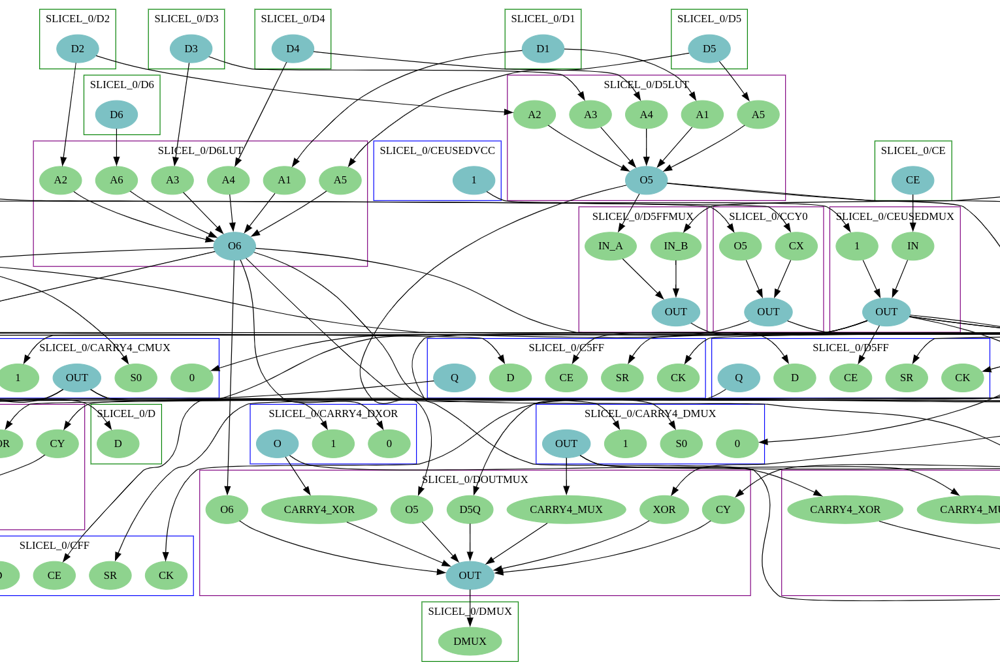

# NISP - Nextpnr-fpga_Interchange Site Preprocessor



## What's NISP

The tool is a simple pin-to-pin site router which gathers information about routability
between pairs of pins within site. The most basic information is whether a possible
route between two given pins exists, but NISP can also gather constraints required for the
routes and can account for alternative routes between pins.

The goal of this tool is to create a sort-of cache with routability data for a given
fpga-interchange device, which can be then used to improve performace of
**nextpnr-fpga_interchange**'s SA placer, which currently suffers from a big performance
hit due to long routability checks that happen during cell placement.

Currently the tool is at an early development stage and does not output BBA/binary, but
it can output JSONs with routability information.

## Features

NISP has the following features at the moment

* Generate site-routing graph and export it into graphviz .dot files
  (`--dot`, `--dot-prefix` options)
* Generate routability lookup and constraints and export it into JSON
  (`--json`, `--json-prefix` options)
* Optimize constraint formulas (use `--no-formula-opt` to skip that step)

## Building NISP

### Prerequisites

1. Install [Rust](https://www.rust-lang.org/)
2. Clone [fpga-interchange-schema](https://github.com/chipsalliance/fpga-interchange-schema)
   (NOTE: To use that schema you need a schema header from
   [Java cap'n proto bindings](https://github.com/capnproto/capnproto-java/tree/81d18463a8f3c98f6d21d4eae27caaca6bace4f7).
   Either install the bindings or, just copy the header located at
   `compiler/src/main/schema/capnp/java.capnp` to your capn' proto include directory, which
   is presumably `/usr/include/capnp/java.capnp` if you are running Linux.)

### Compiling

1. Set `FPGA_INTERCHANGE_SCHEMA_DIR` environmental variable to point to directory where you
   cloned
   [fpga-interchange-schema](https://github.com/chipsalliance/fpga-interchange-schema).
2. Run `cargo build` for debug build, `cargo build --release` for release build.

## Running NISP

```
nisp [OPTIONS] <DEVICE> <BBA> <COMMAND>
```

* `<DEVICE>` - Path to fpga-interchaneg device file
* `<BBA>` - BBA output path. Currently ignored.

Descriptions for currently available options are available when running the program with
`--help` flag.

If an option requires you to specify a list of tile type names, you can use `:all` as a
replacement for listing all tiles in the architecture. To list select entries you can repeat
the flag multiple times (eq. `--json CLEM --json CLEL`). Keep in mind that NISP won't create
any prefix directories you specify on its own.

### `preprocess` subcommand

Gathers information for routability between BEL pins in a site.
Use `--with-debug-hints` to add hints to the outputted JSON that make it easier to read by
a human.

### `route-pair` subcommand

For given pair of BEL pins, print all routes the site-router found as viable.
This option is intended for debugging purposes.

### `test` script
This script can be used to simplify compiling, running and debugging NISP.
It's short, so the best way to understand what it does is just to read it.

## JSON output (`preprocess` subcommand)

The JSON output is created by serializing internal structures of NISP. Its structure might
change over time. As such, I won't be documenting its structure in detail, instead I'm
going to provide a general overview of the content of generated JSONs.

Currently the JSON files which are outputted per-tile contain the following information:

* Routable connections. Th top-level dictionary contains keys consisting of two numbers
  joined by `->` symbol. Those two numbers are indices of BELs. The BELs are indexed in the
  as a continuous array built by enumarating all bel pins in a tile type given the following
  hierarchy: _tile type_ -> _site type_ -> _BEL_ -> _BEL pin_. This indexing is meant to 
  mirror the way python-fpga-interchange writes BBAs which are used to generated binary blobs
  for Nextpnr.

* Each routable connection has two lists associated with it.
  1. _requires_ list, which lists states which are required for given routing.
  2. _implies_ list, which lists the states which are activated when a given routing is used.

  Those lists contain alternative sets, of which any can be used.

* The current constraint information is limited to constraints that would prevent invalid
  pseudo-pip states and reusage of already claimed wires. However, support for cell placements
  constraints is yet to be added, thus nextpnr's site placer can't fully rely on this feature
  yet.

-------------------------------------------------

Copyright (c) 2022 Antmicro 
